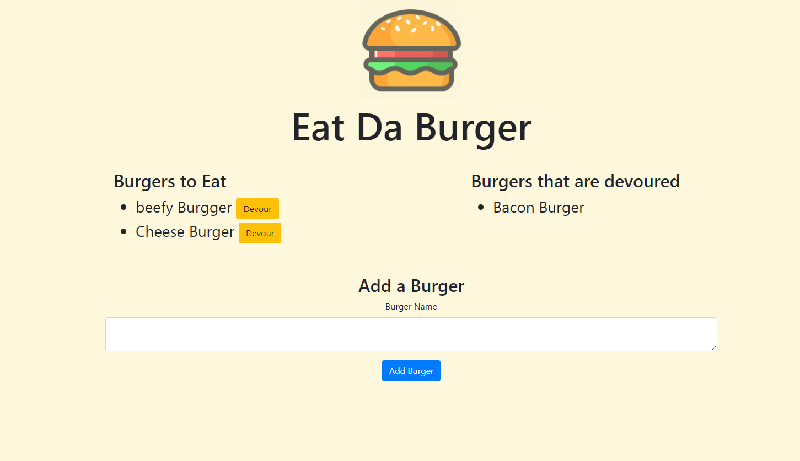

# Eat Da Burger
  

  ## Description 
  
  This is a Node Express application, using MySQL database and handlebars to impliment the HTML.  In this application, the use can input a burger of their choice int text area, and  submit the burger to a que to be devoured.  The burger will appear on the left side of the screen along with a "Devour Button".  Once devoured the burger will be transfered to the right side of the screen.  And, that  is the full extent of the application from the Users perspective.  While simple, it is acutally using fairly complex file communications.  Using the "CRUD" model, this application is Creating objects into our MySQL database, reading from our database and placing on the screen based on the condition of whether it is "devoured" or not.  Then Updating that object as it is "devoured", and an added Delete button to be able to delete the burger from our mySQL database.

  ## Table of Contents

  * [Installation](#Installation)
  * [Usage](#Usage)
  * [Questions](#Questions)
  
  ##  Installation

  Make sure in the correct directory to npm install express, mysql,and  express-handlebars.  

  ## Usage

  Through the Heroku based link, just open the application and start entering in burgers you wish to devour.

  ## Questions

  If you have any questions you can check out my github account: [Rseckman](https://github.com/Rseckman)
  or contact me at rseckman@hotmail.com

  Check out the working app at [Eat Da Burger](https://please-eat-da-burger.herokuapp.com/)

